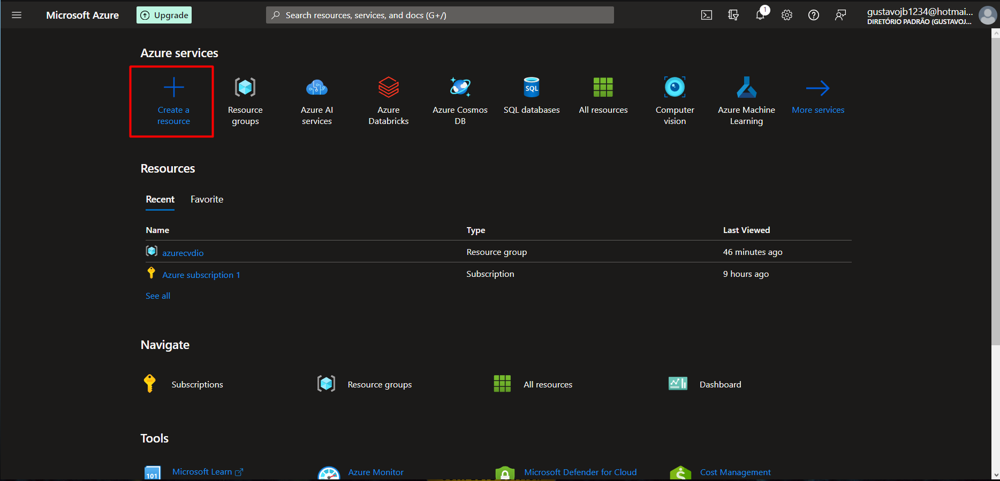
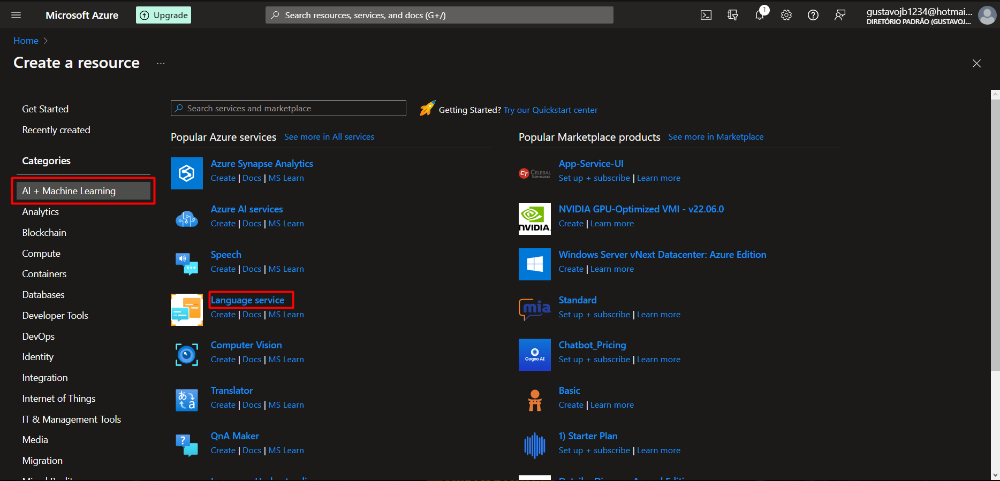
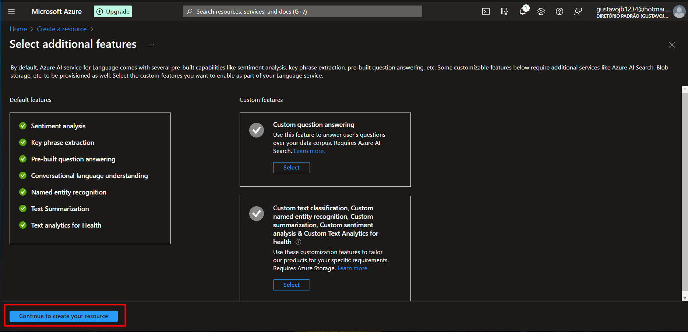
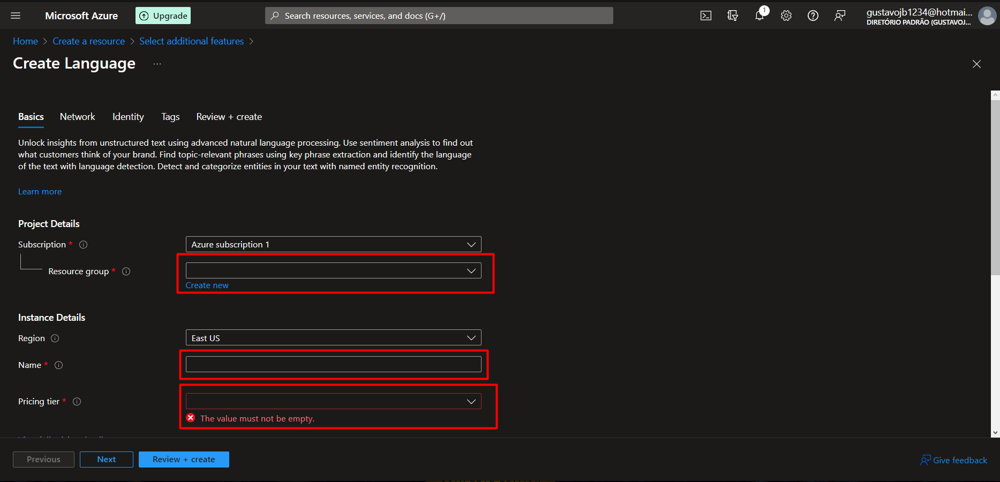
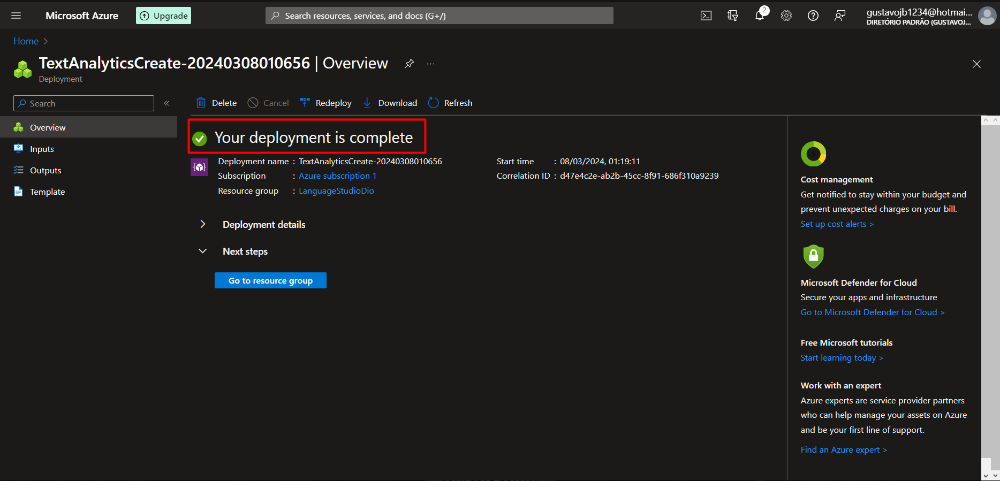
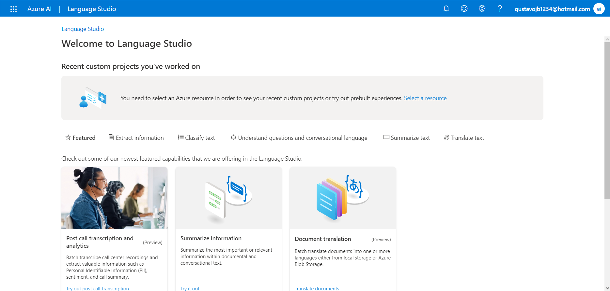
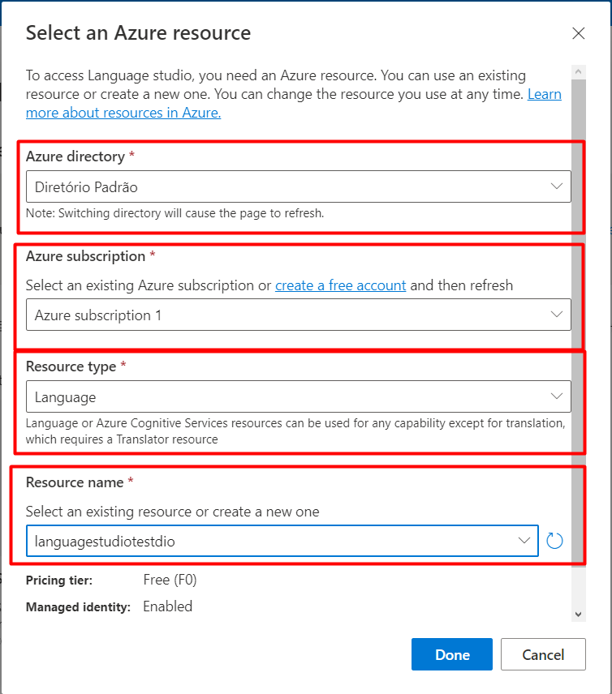
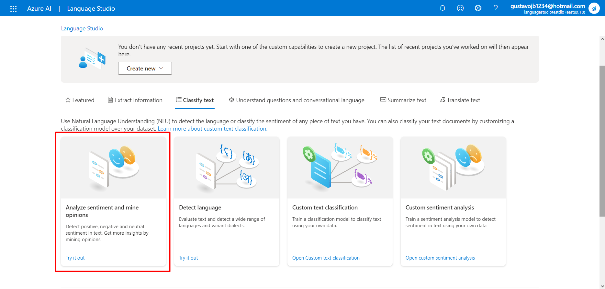
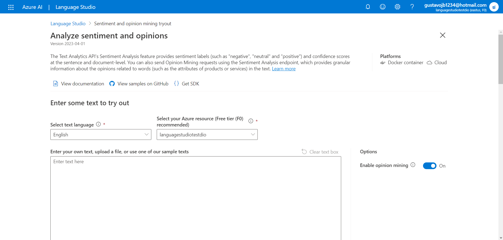

  

## Descrição do Projeto 📚

Este projeto utiliza a plataforma Language Studio do Azure para **Sentiment Analysis** de um texto.

## Conjunto de Dados 💾

O conjunto de dados utilizado neste projeto é apenas um arquivo txt com algumas sentenças para aplicação de NLP.

## Metodologia 📘

A primeira etapa do processo se trata de basicamente criar um novo **Resource** dentro do Microsoft Azure. Para isso, na página inicial do Azure, basta clicar em **"Create a Resource"**:

  

Na próxima etapa, na parte esquerda da tela, basta marcar "AI + Machine Learning" para filtrar os recursos, e então clicar em "Language Service".

  

Logo após, basta clicar em **""Continue to create you resource"**.

  

Em seguida, basta preencher as informações de forma adequada para criar a **"Resource Group"**.

  

Caso o grupo tenha sido criado de forma adequada, uma imagem semelhante a imagem a seguir será mostrada.:

  

O próximo passo é acessar a [Language Studio do Azure](https://language.cognitive.azure.com/home), onde os processos serão executados:

  

Agora, basta utilizar a **Resource Group** criada anteriormente, utilizar uma subscrição adequada, selecionar entre um dos tipos de recursos e dar um nome a este recurso:

  

Agora, o processo está quase finalizado, devemos então clicar na aba "**classify text** e clicar em **"Analyze Sentiment and mine opinions"**

  

Por fim, a única coisa necessária a se fazer é digitar um texto ou então fazer o *upload* de um arquivo txt para que o Language Studio possa fazer a análise de sentimento dentro do texto.

  

## Repositório do Projeto

## Conclusão

Com esse projeto, foi possível explorar outras ferramentas dentro do Ecossistema Azure, empregando análise de sentimentos para denotar o tom em um texto.
